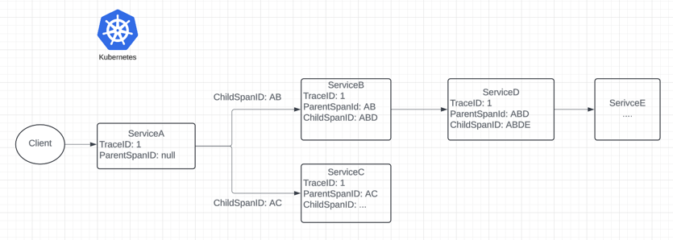

## Cloud
Let's talk following System/Cloud Architecture subjects!
 * [Multi-Region/FailOver](#multi-regionfailover)
 * [Distributed Tracing](#distributed-tracing--observability)

## Multi-region/FailOver
Having our application hosted in multiple regions not only improve overall latency but also provide a way to fail over in event of any regional outage. Furthermore, a centralized domain - say `example.com` instead of `example.east.com` and `exmaple.west.com` - should be used with a DNS Service like AWS Route53 that takes care of routing. 

Technologies used:
* Helm
* AWS Route53
* Kubernetes

Say a service needs to be hosted in both AWS us-east-1 and us-west-1 regions. We can define our helm definitions as below:
```yaml
# us-east-1 definition
apiVersion: extensions/v1beta1
kind: Ingress
metadata:
  name: nginx
  annotations:
    external-dns.alpha.kubernetes.io/aws-region: us-east-1
    external-dns.alpha.kubernetes.io/set-identifier: east

---
# us-east-2 definition
apiVersion: extensions/v1beta1
kind: Ingress
metadata:
  name: nginx
  annotations:
    external-dns.alpha.kubernetes.io/aws-region: us-west-1
    external-dns.alpha.kubernetes.io/set-identifier: west
```
Should result in the below record creation:

| Record name | Type  | Routing Policy | Differentiator | Value/Route traffic to | 
|:------------|:-----:|---------------:| --------------:| ----------------------:|
| example.com | CNAME |        Latency | us-east-1      | default.east.domain    |
| example.com | CNAME |        Latency | us-west-1      | default.west.domain    |  

Note that `default.east.domain` is a default domain that is generated by another AWS Service, such as API Gateway, Application/Network Load Balancers. 


### Distributed Tracing / Observability
Technologies used:
* Spring Cloud
* Micrometer, Brave & Zipkin
* Splunk

In distributed tracing, a span tree is constructed as illustrated with below diagram:




Given above setup, it becomes intuitive to trace the life cycle of a client request. In each downstream call, we can observe the internal state of the request by looking up its spanId.

#### Console logs:
serviceA:
> 2024-04-01T21:27:38.114-04:00 INFO [serviceA, 6628600af2d1ca0962633e65588ac84b, ae3cd4c90aeeb72a] 19380 --- [pool-2-thread-1] io.github.yangfan.core.foo.ServiceBClient     : [ServiceBClient#getUsers] ---> GET http://api.serviceB.com/users/1 HTTP/1.1

serviceB:
> 2024-04-01T21:27:38.114-04:00 INFO [serviceB, 6628600af2d1ca0962633e65588ac84b, f47ac261b3f3c2e7] 19380 --- [pool-1-thread-1] GET /users?id=1


#### Splunk:
We can query all the relevant logs using traceId or parent-child relationship using spanId:
```spl
index=serviceA_dev traceId=6628600af2d1ca0962633e65588ac84b
```