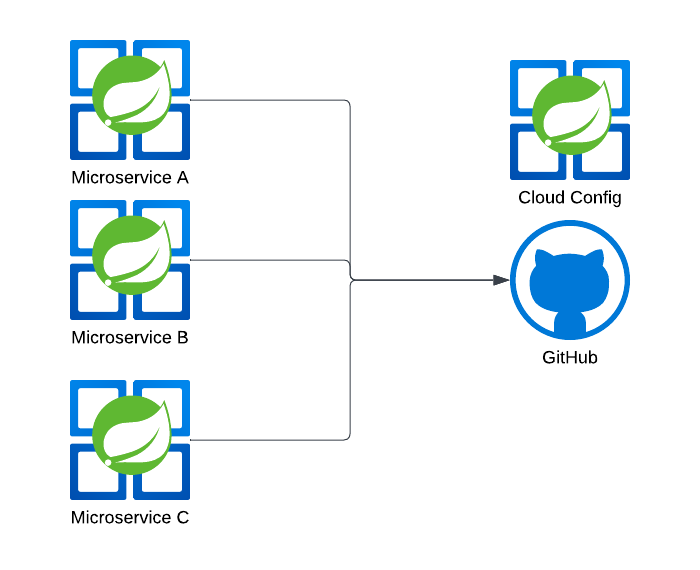

## Cloud
Let's talk following System/Cloud Architecture subjects!
 * [Multi-Region/FailOver](#multi-regionfailover)
 * [Distributed Tracing](#distributed-tracing--observability)
 * [Distrbuted Configruation](#distributed-configuration)
 * [Function as a Service (FaaS)](#function-as-a-service-faas)

## Multi-region/FailOver
Having our application hosted in multiple regions not only improve overall latency but also provide a way to fail over in event of any regional outage. Furthermore, a centralized domain - say `example.com` instead of `example.east.com` and `exmaple.west.com` - should be used with a DNS Service like AWS Route53 that takes care of routing. 

Technologies used:
* Helm
* AWS Route53
* Kubernetes

Say a service needs to be hosted in both AWS us-east-1 and us-west-1 regions. We can define our helm definitions as below:
```yaml
# us-east-1 definition
apiVersion: extensions/v1beta1
kind: Ingress
metadata:
  name: nginx
  annotations:
    external-dns.alpha.kubernetes.io/aws-region: us-east-1
    external-dns.alpha.kubernetes.io/set-identifier: east

---
# us-east-2 definition
apiVersion: extensions/v1beta1
kind: Ingress
metadata:
  name: nginx
  annotations:
    external-dns.alpha.kubernetes.io/aws-region: us-west-1
    external-dns.alpha.kubernetes.io/set-identifier: west
```
Should result in the below record creation:

| Record name | Type  | Routing Policy | Differentiator | Value/Route traffic to | 
|:------------|:-----:|---------------:| --------------:| ----------------------:|
| example.com | CNAME |        Latency | us-east-1      | default.east.domain    |
| example.com | CNAME |        Latency | us-west-1      | default.west.domain    |  

Note that `default.east.domain` is a default domain that is generated by another AWS Service, such as API Gateway, Application/Network Load Balancers. 


### Distributed Tracing / Observability
Technologies used:
* Spring Cloud
* Micrometer, Brave & Zipkin
* Splunk

In distributed tracing, a span tree is constructed as illustrated with below diagram:


Given above setup, it becomes intuitive to trace the life cycle of a client request. In each downstream call, we can observe the internal state of the request by looking up its spanId.

#### Console logs:
serviceA:
> 2024-04-01T21:27:38.114-04:00 INFO [serviceA, 6628600af2d1ca0962633e65588ac84b, ae3cd4c90aeeb72a] 19380 --- [pool-2-thread-1] io.github.yangfan.core.foo.ServiceBClient     : [ServiceBClient#getUsers] ---> GET http://api.serviceB.com/users/1 HTTP/1.1

serviceB:
> 2024-04-01T21:27:38.114-04:00 INFO [serviceB, 6628600af2d1ca0962633e65588ac84b, f47ac261b3f3c2e7] 19380 --- [pool-1-thread-1] GET /users?id=1


#### Splunk:
We can query all the relevant logs using traceId or parent-child relationship using spanId:
```spl
index=serviceA_dev traceId=6628600af2d1ca0962633e65588ac84b
```

### Distributed Configuration
As we deploy an application across different environments, we'd need to externalize application specific configurations. It makes sense to centralize these configurations in a single service as opposed managing each application separately. There are several solutions to this. Two notable ones are:
* Consul
* Cloud Config (Based on Git repository)

#### Consul
HashiCorp's Consul offers a feature allows us to update application configuration on a fly, and across all services in a central store.
If using Spring Boot, we can simply include a starter dependency and configuration url:
```xml
<dependency>
    <groupId>org.springframework.cloud</groupId>
    <artifactId>spring-cloud-starter-consul-config</artifactId>
</dependency>
```
And application properties:
```yaml
# bootstrap.yaml
spring:
  cloud:
    consul:
      host: localhost
      port: 8500
      config.enabled: true

# actuator
management:
  endpoints:
    web:
      exposure:
        include: refresh
```
And with configuration beans annotated with `@RefreshScope`, we can simply update Consul and invoke `/actuator/refresh` API to rebind application properties.
```java

@RefreshScope
@ConfigurationProperties("my.app")
@Configuration
public class MyAppConfig {
    //...
}
```

#### Cloud Config

how do we treat application configuration updates as a versioning system? Spring Cloud Config offers this solution. We can actually store the history of all configuration changes in a Git repository, with each service maintaining a version tag like so:


```
/my-app-a
    /dev
        application.yaml
    /qa
        ..
    /stage
    /prod
/my-app-b
    /dev
    /qa
    /stage
    /prod-east
    /prod-west

# Git tag (version to deploy)
my-app-a-1.0.0
my-app-a-1.0.1
my-app-b-9.8.7
..
```
As part of CICD, we can then generate a tag/label as a snapshot for deployment.


### Function as a Service (FaaS)